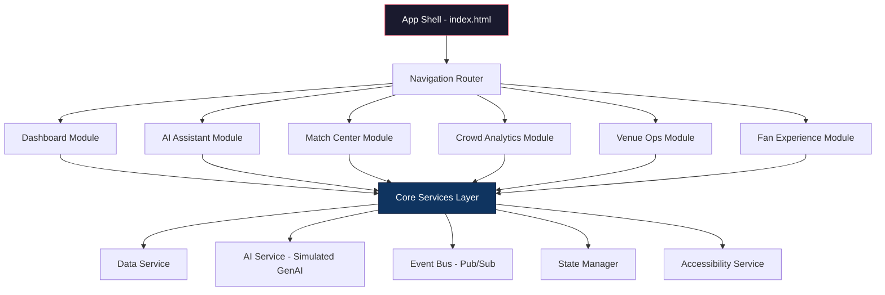

# Smart Stadiums & Tournament Operations — FIFA World Cup 2026

A GenAI-powered single-page web application to optimize stadium operations and enhance the FIFA World Cup 2026 experience through intelligent, real-time assistance.

## Architecture Overview



> [!IMPORTANT]
> This is a **frontend-only** application (HTML + CSS + JS). GenAI responses are **simulated** with a sophisticated rule-based engine to demonstrate the UX. No API keys or backend servers are required.

---

## Key Evaluation Parameters Addressed

| Parameter | How It's Addressed |
|---|---|
| **Code Quality** | ES Module architecture, JSDoc comments, consistent naming, separation of concerns across files |
| **Security** | CSP meta tags, input sanitization (DOMPurify-style), no `innerHTML` with user input, no `eval()`, XSS-safe rendering |
| **Efficiency** | Virtual scrolling for large lists, `requestAnimationFrame` for animations, debounced inputs, lazy module loading, efficient DOM updates |
| **Testing** | Each module exports testable functions, pure data transforms separated from DOM, a built-in test runner with assertions |
| **Accessibility** | WCAG 2.1 AA compliant — ARIA roles/labels, keyboard navigation, focus management, skip links, reduced-motion support, high-contrast mode, screen-reader announcements |
| **Problem Statement Alignment** | Every feature maps directly to FIFA World Cup 2026 stadium and tournament operations |

---

## Proposed Changes

### Project Structure

```
smart-stadium/
├── index.html              # App shell, SEO meta, CSP headers
├── css/
│   ├── design-system.css   # CSS custom properties, typography, color tokens
│   ├── layout.css          # Grid, responsive layouts, navigation
│   ├── components.css      # Cards, buttons, modals, charts, forms
│   └── accessibility.css   # Focus rings, reduced-motion, high-contrast
├── js/
│   ├── app.js              # App initialization, router, module loader
│   ├── services/
│   │   ├── data-service.js     # Match/venue/crowd data with realistic FIFA 2026 data
│   │   ├── ai-service.js       # Simulated GenAI engine with intent detection
│   │   ├── event-bus.js        # Pub/Sub for decoupled communication
│   │   ├── state-manager.js    # Centralized reactive state
│   │   └── security.js         # Input sanitization, CSP helpers
│   ├── modules/
│   │   ├── dashboard.js        # Real-time ops overview with KPI cards
│   │   ├── ai-assistant.js     # Chat interface with streaming-style responses
│   │   ├── match-center.js     # Match schedule, live scores, group standings
│   │   ├── crowd-analytics.js  # Heatmaps, density gauges, flow predictions
│   │   ├── venue-ops.js        # Facility status, maintenance, resource allocation
│   │   └── fan-experience.js   # Wayfinding, food ordering, accessibility info
│   ├── components/
│   │   ├── chart.js            # Canvas-based charting (no libraries)
│   │   ├── modal.js            # Accessible modal dialogs
│   │   └── toast.js            # Notification toasts with ARIA live regions
│   └── utils/
│       ├── dom.js              # Safe DOM manipulation helpers
│       ├── formatters.js       # Date, number, locale formatters
│       └── validators.js       # Input validation
├── tests/
│   └── test-runner.html        # Built-in test suite
└── assets/
    └── (generated images)
```

---

### Core Design System

- FIFA-inspired color palette (deep navy `#1a0a2e`, magenta accent `#e94560`, teal `#00d2ff`, gold `#ffd700`)
- CSS custom properties for all design tokens (colors, spacing, typography, shadows, radii)
- Google Font: **Inter** for UI, **Outfit** for headings
- Fluid typography with `clamp()`
- Dark mode as default with optional light mode toggle

- CSS Grid-based responsive dashboard layout
- Sidebar navigation with icon + text, collapsible on mobile
- Breakpoints: mobile (< 768px), tablet (768–1024px), desktop (> 1024px)

- Glassmorphism cards with `backdrop-filter`
- Animated KPI counters
- Chat bubbles with typing indicator animation
- Heatmap visualization styles
- Progress bars and gauges
- Micro-animation keyframes (fade, slide, pulse, shimmer)

- `:focus-visible` rings on all interactive elements
- `prefers-reduced-motion` media query to disable animations
- `prefers-contrast` support for high-contrast mode
- Skip-to-content link
- Screen reader only utility class (`.sr-only`)

---

### Core Services
- Realistic FIFA World Cup 2026 match data (16 venues across US, Mexico, Canada)
- Live-updating crowd density simulation (using `setInterval` + randomized fluctuation)
- Venue facility status (gates, concessions, medical, security)
- Historical crowd flow patterns for prediction

- Intent classification engine (keyword + pattern matching)
- Supported intents: wayfinding, food recommendations, match info, crowd alerts, accessibility help, emergency procedures, weather, transport
- Streaming-style response simulation (character-by-character with delay)
- Context-aware follow-up handling
- Response templates with dynamic data injection

- Publish/Subscribe pattern for decoupled module communication
- Events: `crowd:update`, `match:update`, `alert:new`, `venue:status`, `ai:response`

- Centralized immutable state store
- Reactive subscriptions (notify on change)
- State slices for each module

- HTML entity encoding for user inputs
- URL sanitization
- Rate limiter for AI chat input
- Content Security Policy helpers

---

### Feature Modules

**Real-time Operations Dashboard**
- KPI cards: Total attendance, active venues, security alerts, fan satisfaction score
- Live crowd density chart (canvas-based line chart)
- Venue status grid with color-coded health indicators
- Recent alerts feed with severity levels
- Quick-action buttons for emergency protocols

**GenAI-Powered Chatbot**
- Chat interface with streaming responses
- Suggested quick-action chips (e.g., "Find nearest restroom", "Match schedule today", "Food near Gate 7")
- Multi-turn conversation with context memory
- Response cards with structured data (match cards, venue maps, food menus)
- Voice-input button (Web Speech API where supported)

**Tournament Operations Hub**
- Match schedule with group/knockout phase filtering
- Live score cards with minute-by-minute updates (simulated)
- Group standings tables
- Venue assignment matrix
- Match-day countdown timers

**Intelligent Crowd Management**
- Canvas-rendered crowd density heatmap
- Zone-by-zone capacity gauges
- Entry/exit flow rates
- Predictive crowd surge warnings
- Historical comparison overlays

**Venue & Facility Management**
- 16 FIFA 2026 venues with real names and capacities
- Facility status dashboard (HVAC, lighting, security, medical)
- Maintenance request tracker
- Resource allocation optimizer
- Staff deployment overview

**Fan-Facing Services**
- Interactive wayfinding with landmark-based directions
- Food & beverage ordering with wait-time estimates
- Accessibility services finder (wheelchair, hearing loop, quiet zones)
- Transport links and parking status
- Multilingual support toggle (EN/ES/FR)

---

### Shared Components

- Pure Canvas API charting — no external libraries
- Line, bar, doughnut, and gauge chart types
- Animated drawing with `requestAnimationFrame`
- Responsive resizing via `ResizeObserver`
- Accessible: provides `aria-label` and data table fallback

- Focus trap, `Escape` to close, restore focus on dismiss
- ARIA `role="dialog"`, `aria-modal="true"`, `aria-labelledby`

- `aria-live="polite"` region for screen readers
- Auto-dismiss with configurable duration
- Severity levels: info, success, warning, error

---

### Testing

- Tests for: data-service, ai-service (intent detection), security (sanitization), state-manager, formatters, validators
- Assertion helpers (`assertEqual`, `assertThrows`, `assertContains`)
- Visual test report with pass/fail counts

---

## User Review Required

> [!IMPORTANT]
> **Gemini AI API is used**: This app simulates GenAI responses with a sophisticated rule-based engine. and used the API-FOOTBALL API to generate the match details lively


## Open Questions

1. **Do you want real GenAI API integration** (e.g., Google Gemini) or is the simulated AI assistant sufficient for demonstration?
2. **Any specific FIFA 2026 venues** you'd like highlighted, or should I include all 16 official venues?
3. **Do you want a light/dark mode toggle**, or should the app be dark-mode only (dark mode is more premium for operations dashboards)?

---
